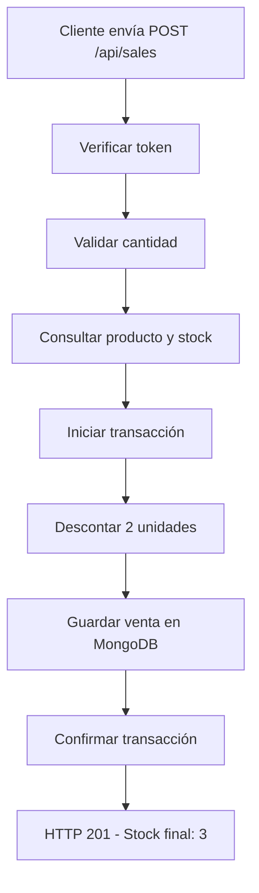
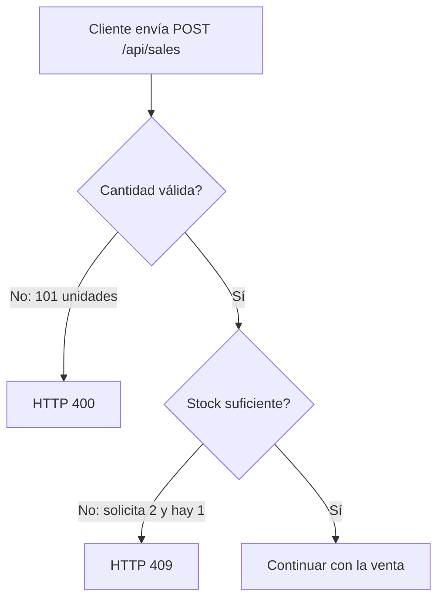
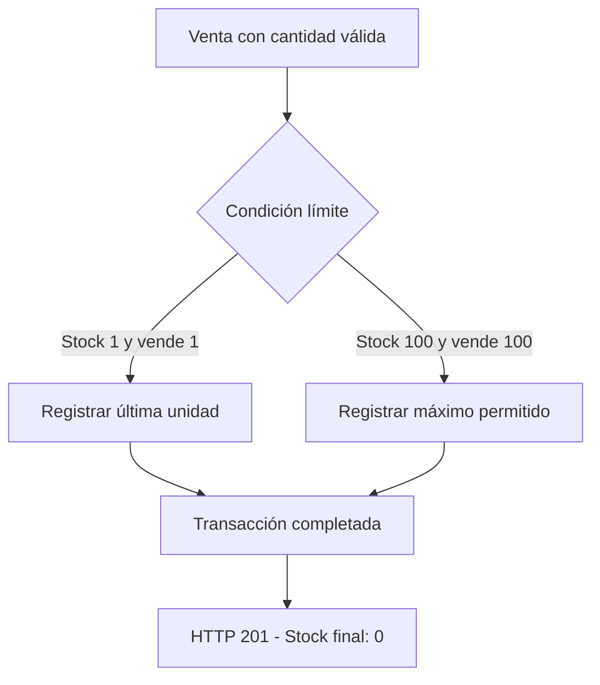

# Flujos de prueba - Registro de ventas

Feature: Registro de ventas
Endpoint: POST /api/sales

## 1. Happy Path - CP-01

```mermaid
flowchart TD
    A[Cliente envía POST /api/sales] --> B[Verificar token]
    B --> C[Validar cantidad]
    C --> D[Consultar producto y stock]
    D --> E[Iniciar transacción]
    E --> F[Descontar 2 unidades]
    F --> G[Guardar venta en MongoDB]
    G --> H[Confirmar transacción]
    H --> I[HTTP 201 - Stock final: 3]
```

## 2. Error Cases - CP-02 y CP-03

```mermaid
flowchart TD
    A[Cliente envía POST /api/sales] --> B{Cantidad válida?}
    B -->|No: 101 unidades| C[HTTP 400]
    B -->|Sí| D{Stock suficiente?}
    D -->|No: solicita 2 y hay 1| E[HTTP 409]
    D -->|Sí| F[Continuar con la venta]
```

## 3. Edge Cases - CP-04 y CP-05

```mermaid
flowchart TD
    A[Venta con cantidad válida] --> B{Condición límite}
    B -->|Stock 1 y vende 1| C[Registrar última unidad]
    B -->|Stock 100 y vende 100| D[Registrar máximo permitido]
    C --> E[Transacción completada]
    D --> E
    E --> F[HTTP 201 - Stock final: 0]
```
